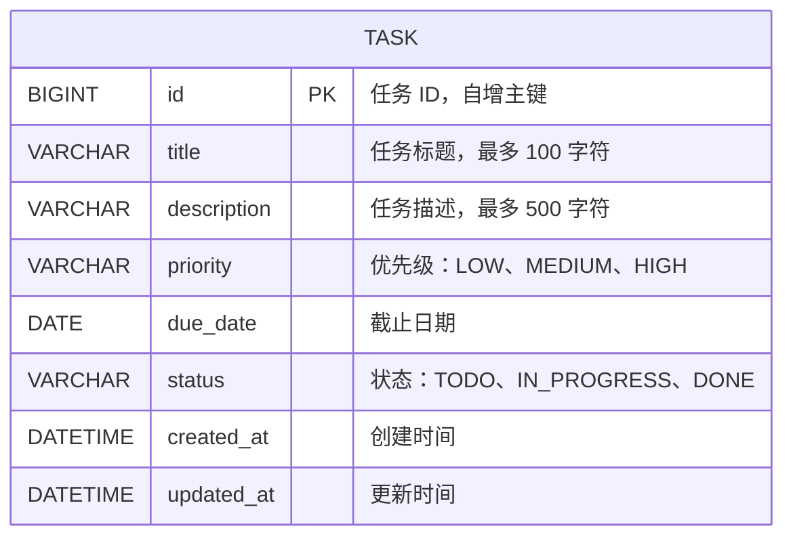
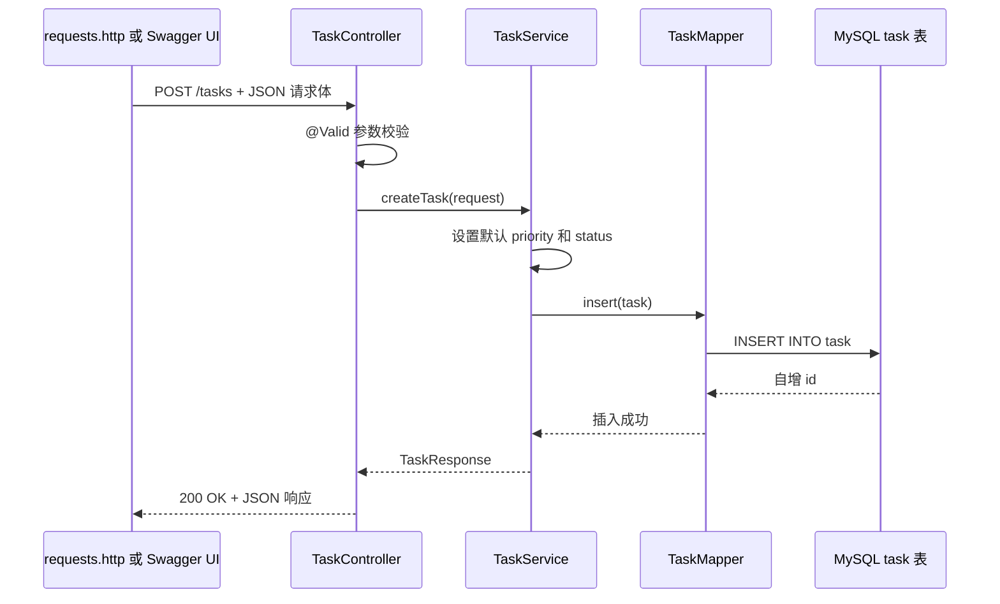
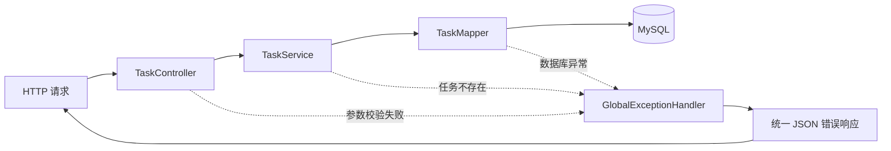
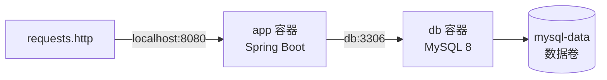

# TaskFlow 架构说明

## 数据库 ER 图

**ER — Entity Relationship，实体关系**：用于描述数据库中表、字段和表之间关系的图。

当前 TaskFlow 只有一个核心实体：任务。



`task` 表当前不包含用户、分类或标签等关联表，因此 ER 图只有一个实体。

## 请求链路图

以“创建任务”为例：



异常链路：



## 分层职责

```text
Controller
  接收 HTTP 请求，提取路径参数、查询参数和 JSON 请求体。

Service
  处理业务规则，例如默认优先级、默认状态、分页参数和任务不存在判断。

Mapper
  使用 MyBatis 注解执行 SQL，不包含业务判断。

MySQL
  持久化保存 task 表中的任务数据。
```

## Docker Compose 运行结构



- `app` 容器运行 TaskFlow。
- `db` 容器运行 MySQL。
- `mysql-data` 数据卷保存 MySQL 数据。
- `docker compose down` 删除容器但保留数据卷。
- `docker compose down -v` 会同时删除数据卷并清空 Compose MySQL 数据。

## 一分钟面试讲解

我完成了一个 TaskFlow 任务管理后端项目，技术栈是 Java 17、Spring Boot、MyBatis 和 MySQL。

项目采用分层架构。Controller 负责接收 REST 请求和参数校验；Service 负责默认状态、分页和任务不存在等业务规则；Mapper 使用 MyBatis 注解执行 SQL；MySQL 负责持久化任务数据。

接口支持任务的新增、查询、按状态筛选、分页、修改、删除和状态更新。我使用 DTO 隔离请求与响应对象，并通过 GlobalExceptionHandler 统一返回 400、404 和 500 错误。

测试方面，我使用 JUnit 测试 Service 核心逻辑，并使用 Mockito 模拟 Mapper，避免单元测试依赖真实数据库。接口测试使用 requests.http，文档使用 SpringDoc OpenAPI 和 Swagger UI。

部署方面，我使用 Dockerfile 构建 Spring Boot 镜像，再通过 Docker Compose 同时启动应用和 MySQL。MySQL 数据通过命名数据卷保存，因此容器重建后数据仍能保留。

## 常见面试追问

### 为什么要分 Controller、Service 和 Mapper？

职责分离让代码更清晰：

- Controller 不写业务规则。
- Service 不直接拼接 SQL。
- Mapper 只负责数据库访问。

这样更容易测试、维护和扩展。

### 为什么 Mapper 没有实现类？

MyBatis 会在运行时为 `TaskMapper` 接口创建代理对象，并执行注解中的 SQL，因此不需要手写 `TaskMapperImpl`。

### 为什么使用 DTO？

**DTO — Data Transfer Object，数据传输对象**：专门用于接口请求和响应的数据对象。

DTO 可以限制客户端可传字段、添加参数校验，并避免直接暴露数据库实体结构。

### Docker 数据卷有什么作用？

MySQL 容器只是运行数据库程序；数据卷保存真正的数据库文件。普通删除容器后，重新挂载同一数据卷仍能读到原来的任务数据。

### 当前项目可以继续扩展什么？

下一阶段可以增加用户系统、登录认证、标签、任务分类和前端页面。但在本项目中，先保持单体后端结构，重点理解基础后端工程流程。